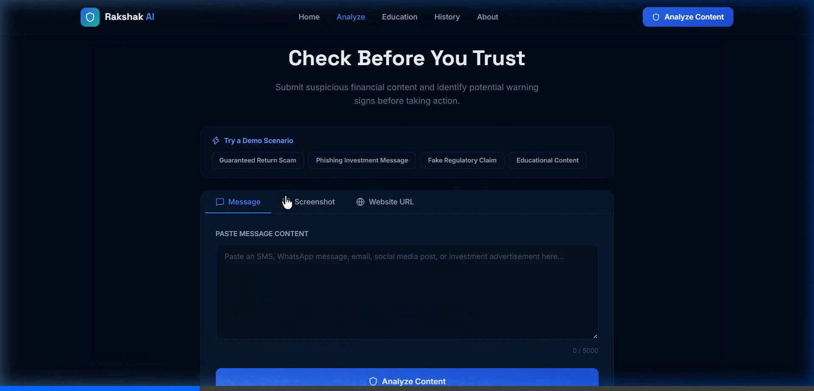
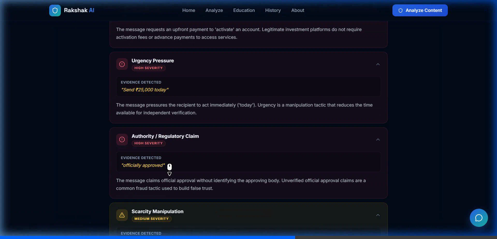
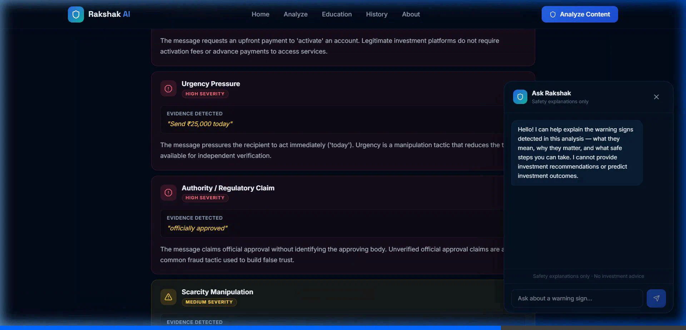

# 🛡️ Rakshak AI

> **Detect. Understand. Stay Safe.**  
> An evidence-first, explainable investor-safety companion developed for the **SANGYAN Hackathon** (Track: *Digital Fraud & Scam Resilience*).

[](LICENSE)
[](https://python.org)
[](https://fastapi.tiangolo.com)
[](https://react.dev)
[](https://typescriptlang.org)
[](https://vitejs.dev)

---

## 📌 Problem

India is undergoing an unprecedented retail investment boom, with millions of first-time investors entering the stock market and mutual funds. However, this growth has created an attractive target for digital fraudsters. 

Every day, everyday citizens receive deceptive solicitations via WhatsApp, Telegram, Instagram, and SMS promising:
* **Guaranteed high returns** (e.g., "30% monthly fixed return")
* **Fake regulatory endorsements** (fabricated SEBI, RBI, or exchange registration certificates)
* **Manufactured urgency and scarcity** ("Only 5 VIP slots remain today")
* **Bogus pre-IPO or institutional quota schemes** requiring upfront deposits
* **Phishing portals** harvesting demat/bank credentials or OTPs

First-time and retail investors often lack the specialized regulatory knowledge to verify these claims. Traditional cybersecurity tools only provide binary, opaque verdicts ("safe" or "unsafe"), leaving users without actionable context.

---

## 💡 Solution

**Rakshak AI** bridges the investor-protection gap through **evidence-first explainable fraud intelligence**. 

Instead of an arbitrary rating, Rakshak AI dissects suspicious financial content to answer four critical questions:
1. **What** specific manipulation tactics are present?
2. **Where** does the evidence appear in the text?
3. **Why** is this tactic dangerous according to regulatory principles?
4. **What** concrete, safe steps should the user take next?

Rakshak AI works across **text messages**, **mobile screenshots**, and **suspicious URLs**, providing both a deterministic risk score (0–100) and plain-language guidance that any first-time investor can act upon.

---

## ✨ Features

- **Multi-Modal Threat Ingestion**:
  - **Message Analysis**: Scan SMS, WhatsApp, and Telegram solicitations.
  - **Screenshot Analysis**: Upload mobile screenshots of chat groups or brochures for text extraction and analysis.
  - **URL Verification**: Scan suspicious broker, advisory, or investment URLs.
- **Deterministic & Heuristic Risk Engine**:
  - 0–100 Risk Score with color-coded severity: `LOW`, `MEDIUM`, `HIGH`.
  - Detection of 8+ fraud patterns (Guaranteed Returns, Upfront Fee Requests, Urgency Pressure, Authority Impersonation, Scarcity Tactics, Credential Harvesting, and Threat Language).
- **Exact Evidence Pinpointing**:
  - Highlights precise quotes and spans directly from the submitted content.
- **Plain-Language Explanations**:
  - Demystifies financial and legal jargon into reassuring, actionable investor advice.
- **Actionable Next Steps**:
  - Step-by-step guidance on searching official SEBI/RBI registries and reporting cyber fraud (National Cyber Crime Portal & Helpline 1930).
- **Interactive "Ask Rakshak" AI Safety Chat**:
  - Context-aware chatbot answering follow-up safety questions without giving financial advice.
- **Investor Education Hub**:
  - 8 interactive scam deep-dives (Pump & Dump, Dabba Trading, Pre-IPO Fraud, Deepfake Endorsements, etc.).
  - Interactive **5-Second Investor Safety Checklist** with real-time score feedback.
- **Scan History & Analytics**:
  - Local history log with risk distributions and instant one-click data deletion for privacy.

---

## 🏗️ Architecture

```text
 ┌──────────────────────────────────────────────────────────────┐
 │                     User Interface (Browser)                 │
 │       React 19 + TypeScript + Vite + Tailwind CSS System     │
 └───────────────────────────────┬──────────────────────────────┘
                                 │ REST API (JSON)
                                 v
 ┌──────────────────────────────────────────────────────────────┐
 │                  FastAPI Application (Python)                │
 │                     Lifespan • CORS • Pydantic               │
 └───────┬───────────────────────┬──────────────────────┬───────┘
         │                       │                      │
         v                       v                      v
 ┌───────────────┐       ┌───────────────┐      ┌───────────────┐
 │ Text Pipeline │       │  OCR Pipeline │      │  URL Analyzer │
 │ Clean & Norm  │       │ Image Extract │      │ Domain Health │
 └───────┬───────┘       └───────┬───────┘      └───────┬───────┘
         │                       │                      │
         └───────────────────────┼──────────────────────┘
                                 v
 ┌──────────────────────────────────────────────────────────────┐
 │               Rule-Based Risk Engine (scorer.py)             │
 │         Signal Matchers • Severity Weights • Score (0-100)   │
 └───────────────────────────────┬──────────────────────────────┘
                                 v
 ┌──────────────────────────────────────────────────────────────┐
 │            Explainability & Intelligence (analyzer.py)       │
 │   Offline Fallback Engine   OR   OpenAI GPT-4o-mini Reasoning │
 └───────────────────────┬──────────────────────────────┬───────┘
                         v                              v
 ┌───────────────────────────────┐      ┌───────────────────────┐
 │    Evidence-First JSON Report │      │ Local SQLite Database │
 │    Score, Signals, Safe Steps │      │ Async Scan Log & Stats│
 └───────────────────────────────┘      └───────────────────────┘
```

---

## 🛠️ Tech Stack

| Layer | Technologies |
| :--- | :--- |
| **Frontend** | React 19, TypeScript, Vite, Tailwind CSS, Lucide React, Axios, React Dropzone, React Router DOM |
| **Backend** | Python 3.10+, FastAPI, Uvicorn, Pydantic, HTTPX, Pillow, pytesseract (OCR) |
| **AI / NLP** | Rule-based fraud pattern heuristic engine, OpenAI GPT-4o-mini (optional), deterministic scenario pipeline |
| **Database** | SQLite, SQLAlchemy (asyncio), aiosqlite |
| **Testing** | Pytest, TypeScript compiler (`tsc`), automated browser subagent verification |

---

## 📁 Project Structure

```text
rakshak-ai/
├── backend/
│   ├── app/
│   │   ├── ai/
│   │   │   ├── __init__.py
│   │   │   └── analyzer.py          # AI reasoning, URL heuristic & chat handlers
│   │   ├── api/
│   │   │   ├── __init__.py
│   │   │   └── routes.py            # FastAPI endpoints (/health, /analyze, /chat, etc.)
│   │   ├── database/
│   │   │   ├── __init__.py
│   │   │   └── db.py                # Async SQLite storage & statistics
│   │   ├── models/
│   │   │   ├── __init__.py
│   │   │   └── schemas.py           # Pydantic schemas
│   │   ├── risk_engine/
│   │   │   ├── __init__.py
│   │   │   └── scorer.py            # Rule-based scam detection & scoring engine
│   │   ├── __init__.py
│   │   └── demo_scenarios.py        # Curated offline scam test scenarios
│   ├── main.py                      # FastAPI entry point & CORS configuration
│   ├── requirements.txt             # Python dependencies
│   ├── test_risk.py                 # Risk engine verification script
│   └── .env                         # Backend environment config (git-ignored)
├── frontend/
│   ├── src/
│   │   ├── assets/                  # Logos and icons
│   │   ├── components/
│   │   │   ├── AskRakshak.tsx       # Safety AI chatbot drawer
│   │   │   ├── Navbar.tsx           # Navigation bar with live backend status
│   │   │   ├── RiskCard.tsx         # Visual risk score gauge
│   │   │   └── SignalCard.tsx       # Flagged red flag card with evidence quote
│   │   ├── pages/
│   │   │   ├── AboutPage.tsx        # Project mission & architecture
│   │   │   ├── AnalyzerPage.tsx     # Message, Screenshot & URL analyzer
│   │   │   ├── EducationPage.tsx    # 8 Scam types & 5s Safety Checklist
│   │   │   ├── HistoryPage.tsx      # Past scans log & analytics
│   │   │   ├── LandingPage.tsx      # Hero section & threat highlights
│   │   │   └── ResultsPage.tsx      # Explainable analysis report
│   │   ├── services/
│   │   │   └── api.ts               # Axios API client
│   │   ├── types/
│   │   │   └── index.ts             # TypeScript interfaces
│   │   ├── App.tsx                  # Root application router
│   │   ├── index.css                # Custom design system & theme variables
│   │   └── main.tsx                 # React entry point
│   ├── package.json                 # Frontend dependencies
│   ├── vite.config.ts               # Vite configuration
│   └── .env                         # Frontend environment config (git-ignored)
├── demo/
│   ├── sample_whatsapp_scam.png     # Test screenshot for image upload
│   ├── sample_fake_brochure.png     # Test brochure image for image upload
│   ├── sample_test_inputs.md        # Curated test messages & URLs
│   ├── DEMO_SCRIPT.md               # 3-5 minute demo walkthrough script
│   └── generate_demo_images.py      # Python script to reproduce test screenshots
├── docs/
│   ├── ARCHITECTURE.md              # In-depth architectural blueprint
│   ├── AI_ANALYSIS.md               # Risk engine & AI safety methodology
│   ├── DEMO_GUIDE.md                # Step-by-step testing & demo guide
│   └── screenshots/                 # Application UI captures
├── presentation/
│   ├── PPT_CONTENT.md               # 8-slide presentation content
│   └── screenshots/                 # Presentation slides graphic captures
├── start.bat                        # One-click Windows startup script
├── start.ps1                        # One-click PowerShell startup script
├── .env.example                     # Environment variables template
├── .gitignore                       # Git ignore configuration
├── SUBMISSION_DESCRIPTION.md        # 500-word hackathon submission write-up
├── SUBMISSION_CHECKLIST.md          # Complete hackathon verification checklist
└── README.md                        # Project documentation
```

---

## 🚀 Setup

### Prerequisites
* **Python**: 3.10 or higher
* **Node.js**: 18.0 or higher
* **npm**: 9.0 or higher
* **Git**

---

## ⚙️ Environment Variables

Create environment configuration files from the provided `.env.example` template:

### 1. Root / Backend (`backend/.env`):
```ini
DEMO_MODE=true
OPENAI_API_KEY=
AI_MODEL=gpt-4o-mini
OPENAI_API_BASE=https://api.openai.com/v1
BACKEND_HOST=0.0.0.0
BACKEND_PORT=8001
CORS_ORIGINS=http://localhost:5173,http://127.0.0.1:5173
DATABASE_URL=sqlite+aiosqlite:///./rakshak.db
```

### 2. Frontend (`frontend/.env`):
```ini
VITE_API_BASE_URL=http://localhost:8001
VITE_DEMO_MODE=true
```

> **Note**: Setting `DEMO_MODE=true` allows Rakshak AI to run completely offline without an OpenAI API key.

---

## 💻 Running the Application

### Option A: One-Click Launch (Windows)
Double-click `start.bat` in the root folder, or run in PowerShell:
```powershell
.\start.ps1
```
This automatically starts both the FastAPI backend and Vite frontend, then launches your default browser.

---

### Option B: Manual Startup

#### 1. Running the Backend
```bash
cd backend
python -m venv venv
# On Windows:
venv\Scripts\activate
# On Linux/macOS:
source venv/bin/activate

pip install -r requirements.txt
python -m uvicorn main:app --reload --host 127.0.0.1 --port 8001
```
* Backend will be available at: **http://127.0.0.1:8001**
* Interactive API Documentation (Swagger UI): **http://127.0.0.1:8001/docs**

#### 2. Running the Frontend
In a separate terminal:
```bash
cd frontend
npm install
npm run dev
```
* Frontend will be available at: **http://localhost:5173**

---

## 🧪 Demo Mode

Rakshak AI is built with hackathon reliability as a primary design objective.

When `DEMO_MODE=true` is enabled:
1. **Zero External API Calls**: The application operates with 100% reliability, zero latency spikes, and no external API rate-limit errors.
2. **Instant Preset Buttons**: On the Analyzer page, users can click one-click preset buttons:
   * *Guaranteed 30% Return Scam* (Score 91, High Risk)
   * *Task / Part-Time Job Fraud* (Score 88, High Risk)
   * *Pre-IPO Allocation Scam* (Score 85, High Risk)
   * *Legitimate SIP Notification* (Score 0, Low Risk)
3. **Deterministic Scoring**: The underlying Python regex and linguistic parser identifies all red flags offline.

To enable OpenAI GPT-4o-mini live augmentation, set `DEMO_MODE=false` and insert your `OPENAI_API_KEY` in `backend/.env`.

---

## 🔍 Test Scenarios

Try these sample inputs directly in the `/analyze` tab:

### Scenario 1: High Risk Guaranteed Return Message
```text
Exclusive investment opportunity. Earn a guaranteed 30% monthly return. This opportunity is officially approved. Send Rs. 25,000 today to activate your account. Only 5 slots remain.
```
* **Score**: 91 / 100 (`HIGH`)
* **Signals**: Guaranteed Return Claim, Upfront Payment Request, Urgency Pressure, Unverified Regulatory Claim, Scarcity Manipulation.

### Scenario 2: Phishing URL
```text
https://sebi-secure-portal-verification-login.in/update-kyc
```
* **Score**: 85 / 100 (`HIGH`)
* **Signals**: Regulatory Impersonation, Suspicious Top-Level Domain, Credential Phishing.

### Scenario 3: Legitimate SIP Confirmation
```text
Dear Investor, your monthly SIP of Rs. 2,000 in Nifty 50 Index Fund has been successfully processed. NAV: 184.20. Investments are subject to market risks. Read all scheme documents carefully.
```
* **Score**: 0 / 100 (`LOW`)
* **Signals**: No scam patterns; standard regulatory risk disclaimer detected.

---

## 📡 API Endpoints

| Method | Endpoint | Description |
| :--- | :--- | :--- |
| `GET` | `/api/health` | Service health status, demo mode flag, AI status |
| `POST` | `/api/analyze/text` | Analyzes text message content and returns risk breakdown |
| `POST` | `/api/analyze/image` | Processes screenshot uploads via OCR and evaluates risk |
| `POST` | `/api/analyze/url` | Evaluates suspicious URLs for domain spoofing and phishing |
| `POST` | `/api/chat` | Interactive safety Q&A with the Ask Rakshak assistant |
| `GET` | `/api/history` | Retrieves recent scan history records |
| `DELETE` | `/api/history` | Purges all scan history records from the local database |
| `GET` | `/api/stats` | Aggregated risk score distribution and total scans |
| `GET` | `/api/demo/scenarios` | Predefined offline demo scenarios |

---

## 🛡️ Safety & Limitations

Rakshak AI adheres to strict investor-safety boundaries:
* **No Investment Advice**: Does NOT offer stock recommendations, portfolio management, or buy/sell/hold ratings.
* **No Price Predictions**: Does NOT predict market trends, returns, or security valuations.
* **Explicit Uncertainty**: Always states that AI and heuristics provide risk indicators, not judicial determinations of fraud.
* **Privacy by Design**: Never requests PAN, Aadhaar, demat account numbers, or bank passwords.
* **Local Data Sovereignty**: Scan history is stored locally in SQLite and can be permanently deleted at any moment.

---

## 📸 Screenshots

| Landing Page | Analyzer Interface |
| :---: | :---: |
|  |  |

| Risk Score Gauge | Flagged Signals & Evidence |
| :---: | :---: |
|  |  |

---

## 🎥 Demo Video

* **Video Walkthrough Script**: [demo/DEMO_SCRIPT.md](demo/DEMO_SCRIPT.md)
* **Target Duration**: 3–5 minutes
* **Demo Sequence**: Problem Hook ➔ Rakshak AI Introduction ➔ Guaranteed Return Scan ➔ Screenshot Analysis ➔ Education Hub & Checklist ➔ Privacy History ➔ Closing.

---

## 🔮 Future Scope

1. **Regional Indian Languages**: Expanding the heuristic and NLP models to Hindi, Gujarati, Marathi, Tamil, Telugu, and Bengali.
2. **Direct SEBI / RBI Registry Integration**: Real-time automated verification against SEBI's intermediary database (sebi.gov.in).
3. **Deepfake Audio/Video Detection**: Identifying synthesized celebrity/finfluencer video endorsements.
4. **Crowdsourced Threat Radar**: Anonymous community reporting to flag emerging scam campaigns across India before they spread.
5. **Messaging App Bot**: Integrating Rakshak AI as an on-demand WhatsApp and Telegram safety verification bot.

---

## 👥 Contributors

* **Team Rakshak AI** — Developed for the SANGYAN Investor Protection Hackathon (2026).
* **Track**: Digital Fraud & Scam Resilience
