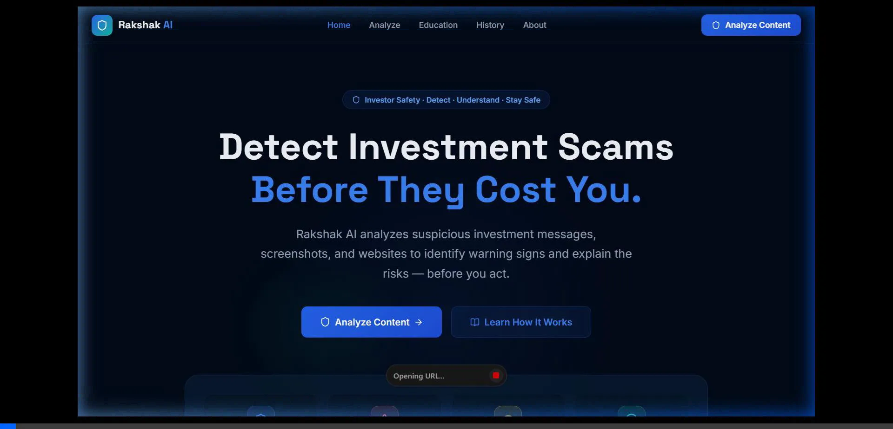
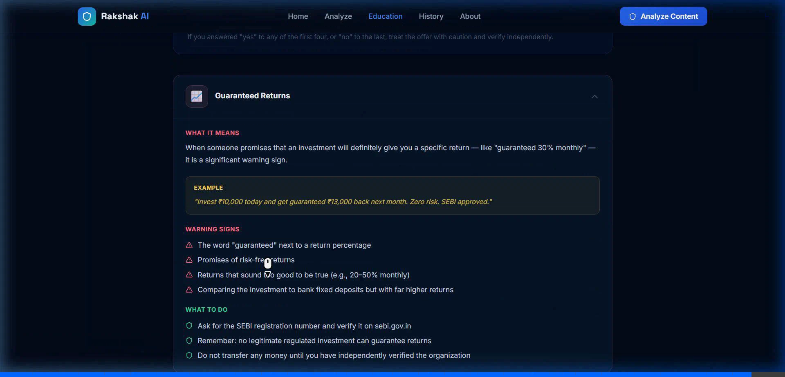

# 🛡️ Rakshak AI — Presentation Slides Content

**Event:** SANGYAN Hackathon  
**Track:** Digital Fraud & Scam Resilience  
**Design Palette:** Deep Navy (`#020B18`), Electric Blue (`#3B82F6`), Cyan Accent (`#22D3EE`), Slate White (`#F8FAFC`)  
**Typography:** Space Grotesk (Headers), Inter (Body)

---

## Slide 1 — Title

### Visual Layout:
* Minimalist dark fintech backdrop with glowing cyber shield insignia.
* Clean centered alignment with track badge and hackathon branding.

```text
                                  🛡️
                              RAKSHAK AI
                     Detect. Understand. Stay Safe.

         AI-Powered Investor Scam & Misinformation Shield
```

* **Event:** SANGYAN Hackathon
* **Track:** Digital Fraud & Scam Resilience
* **Tagline:** *Detect. Understand. Stay Safe.*
* **Purpose:** Empowering India's retail investors with evidence-first fraud intelligence.

---

## Slide 2 — Problem

### Title: **The Problem**
#### Subtitle: *The Perilous Journey of the Unprotected Retail Investor*

### Visual Journey Diagram:
```text
  [ Social Media / WhatsApp / SMS ]
                 ↓
  [ Suspicious Investment Claim ]
    • "Guaranteed 30% monthly returns"
    • "Pre-IPO quota, only 5 slots"
    • "Official SEBI approved scheme"
                 ↓
  [ Investor Confusion & Anxiety ]
    • Is this legitimate or fraudulent?
    • How do I verify regulatory claims?
                 ↓
  [ High-Risk Outcome: Capital / Credential Loss ]
```

### Key Realities:
* **Rapid Market Inflow:** First-time retail investors encounter sophisticated, persuasive digital solicitations daily.
* **Psychological Exploitation:** Scammers deploy manufactured urgency, artificial scarcity, and forged regulatory authority.
* **The Literacy Gap:** Novices lack contextual verification tools; traditional cybersecurity filters give binary, unhelpful warnings without explanations.

---

## Slide 3 — Target Users

### Title: **Who Are We Protecting?**
#### Subtitle: *Bridging the Protection Gap for India's Diverse Retail Population*

```text
 ┌───────────────────────────┐      ┌───────────────────────────┐
 │   First-Time Investors    │      │  Active Retail Investors  │
 │  Navigating capital       │      │  Vulnerable to unverified │
 │  markets for first time   │      │  stock tips & IPO scams   │
 └───────────────────────────┘      └───────────────────────────┘
 ┌───────────────────────────┐      ┌───────────────────────────┐
 │    Young Digital Users    │      │         Families          │
 │  Encountering high-yield  │      │  Evaluating digital       │
 │  offers on social media   │      │  wealth opportunities     │
 └───────────────────────────┘      └───────────────────────────┘
 ┌──────────────────────────────────────────────────────────────┐
 │               Digitally Less-Experienced Citizens            │
 │  Seeking an objective, jargon-free second opinion             │
 └──────────────────────────────────────────────────────────────┘
```

### The Universal Question:
> *"I received this message on WhatsApp. Is it safe to send money?"*

---

## Slide 4 — Solution

### Title: **Rakshak AI**
#### Subtitle: *Evidence-First Investor Safety & Threat Decryption*

### Core Workflow:
```text
   [ Input: Message / Screenshot / URL ]
                    ↓
          [ AI + Rule Engine ]
                    ↓
           [ Warning Signals ]
                    ↓
            [ Exact Evidence ]
                    ↓
          [ Plain Explanation ]
                    ↓
           [ Actionable Steps ]
```

### Core Value Proposition:
> **"Rakshak AI transforms suspicious financial content into an understandable, evidence-backed investor-safety report."**

* **Not Just a Label:** Moves beyond opaque "Safe/Unsafe" verdicts to reveal the exact psychological and financial traps in the message.
* **Instant Clarification:** Identifies manipulation before any money moves.

---

## Slide 5 — How It Works

### Title: **Technical Architecture**
#### Subtitle: *Modern, Resilient, and Privacy-Preserving System Design*

### Architecture Flow:
```text
   +-----------------------------------------------------------+
   |            Frontend: React 19 + TypeScript + Vite         |
   |           Tailwind CSS Design System • Lucide Icons       |
   +-----------------------------------------------------------+
                                |  REST API
                                v
   +-----------------------------------------------------------+
   |                  Backend: FastAPI (Python)                |
   +-----------------------------------------------------------+
                                |
             +------------------+------------------+
             |                  |                  |
             v                  v                  v
     [ Text Pipeline ]    [ OCR Engine ]    [ URL Analyzer ]
     Raw message parsing  Image extraction  Domain heuristics
             |                  |                  |
             +------------------+------------------+
                                |
                                v
   +-----------------------------------------------------------+
   |               Deterministic Risk Scorer (0-100)           |
   |      Signal Weights • Pattern Matchers • Evidence Pins    |
   +-----------------------------------------------------------+
                                |
                                v
   +-----------------------------------------------------------+
   |              Contextual AI & Explainability Engine        |
   |    OpenAI GPT-4o-mini Reasoning / Heuristic Demo Mode     |
   +-----------------------------------------------------------+
                                |
             +------------------+------------------+
             v                                     v
   [ Evidence-First Report ]               [ SQLite Database ]
   Plain-language safety card              Async scan history
```

### Component Roles:
* **Frontend:** High-performance responsive UI with progress scanning visualizer and interactive safety checklist.
* **Deterministic Risk Engine:** Instant offline scoring based on regulatory scam taxonomy.
* **AI Explainability:** Contextual translation of technical red flags into simple, accessible language.
* **Async Storage:** Ephemeral, privacy-focused SQLite history that users can purge with one click.

---

## Slide 6 — Live Prototype

### Title: **From Suspicious Message to Safety Report**
#### Subtitle: *Demonstrating the Working Rakshak AI Pipeline*

### Prototype Walkthrough Steps:

```text
 1. Input Submission          2. Multi-Stage Scanning       3. Risk Meter
 [ Paste message / image ]  -> [ Heuristic + AI pass ]   -> [ Score: 91 | HIGH RISK ]
          ↓                            ↓                            ↓
 4. Flagged Signals           5. Exact Quoted Evidence      6. Simple Explanation
 [ Guaranteed Return,         [ "guaranteed 30% monthly",   [ "No legitimate investment
   Urgency, Fake SEBI ]         "only 5 slots remain" ]       can guarantee returns..." ]
```

### Live UI Captures from Prototype:
* **Step 1: Landing Page & Threat Feed**  
  
* **Step 2: Multi-Modal Analyzer Interface**  
  
* **Step 3: Risk Assessment & Score Card**  
  
* **Step 4: Warning Signals & Highlighted Evidence**  
  
* **Step 5: Interactive Investor Education Hub**  
  

---

## Slide 7 — Innovation + Safety

### Title: **Why Rakshak AI?**
#### Subtitle: *Foundational Principles Behind Our Architecture*

```text
  ┌─────────────────────────────────────────────────────────────┐
  │ 🔍 EVIDENCE FIRST                                           │
  │ Never issues arbitrary verdicts; highlights exact quotes    │
  │ and specific manipulation tactics directly in the content.  │
  ├─────────────────────────────────────────────────────────────┤
  │ 🛡️ SAFETY FIRST                                             │
  │ Strictly educational. Zero stock tips, buy/sell calls,      │
  │ or market price predictions.                                │
  ├─────────────────────────────────────────────────────────────┤
  │ 💡 EXPLAINABLE & ACCESSIBLE                                 │
  │ Replaces legalistic disclaimers with plain, reassuring      │
  │ language that any first-time investor can act upon.         │
  ├─────────────────────────────────────────────────────────────┤
  │ 🔒 PRIVACY BY DESIGN                                        │
  │ Never requests bank credentials, OTPs, or PAN; full local   │
  │ control allows immediate one-click scan history deletion.   │
  ├─────────────────────────────────────────────────────────────┤
  │ ⚡ DUAL-MODE RESILIENCE                                      │
  │ Runs 100% offline with zero external API dependencies via   │
  │ deterministic engine, or enhances with LLM reasoning.       │
  └─────────────────────────────────────────────────────────────┘
```

---

## Slide 8 — Impact & Future

### Title: **Building a Safer Investor Ecosystem**
#### Subtitle: *From Hackathon Prototype to Nationwide Investor Shield*

### Roadmap:

| Current Prototype | Scalable Future |
| :--- | :--- |
| **Multimodal Scanning** (Text, Image, URL) | **Multilingual Support** (Hindi, Tamil, Telugu, Marathi, Bengali) |
| **Deterministic Risk Engine** (0-100 Score) | **Direct SEBI/RBI API Integration** for real-time verification |
| **Evidence Extraction & Explainability** | **Deepfake Video & Voice Note** scam detection |
| **8-Type Education Hub + 5s Checklist** | **Crowdsourced Threat Intelligence Feed** |
| **Interactive Safety Chatbot** | **WhatsApp & Telegram Bot Integration** |

---

### Closing Statement:

> ### *"Before you invest, understand what you're seeing."*
>
> **Rakshak AI**  
> *Detect. Understand. Stay Safe.*
